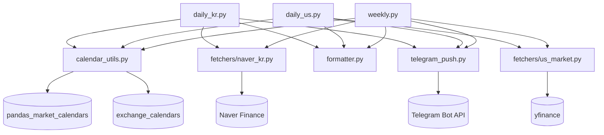

# 모듈 책임과 공개 인터페이스 — rs-golden-queens

`market_flow/` 패키지 각 모듈의 책임·공개 API·라인 수·의존성을 정리한다.
라인 수는 2026-05-25 기준 직접 측정값.

---

## 모듈 목록

| 모듈 | 경로 | 라인 수 | 역할 |
|---|---|---|---|
| `daily_kr.py` | `market_flow/daily_kr.py` | 48 | 한국장 일간 진입점 |
| `daily_us.py` | `market_flow/daily_us.py` | 59 | 미국장 일간 진입점 (DST 게이트 포함) |
| `weekly.py` | `market_flow/weekly.py` | 69 | 주간 리포트 진입점 |
| `calendar_utils.py` | `market_flow/calendar_utils.py` | 135 | 거래일·DST 판정 유틸리티 |
| `formatter.py` | `market_flow/formatter.py` | 362 | 메시지 포맷 (한국 색 컨벤션 포함) |
| `telegram_push.py` | `market_flow/telegram_push.py` | 91 | Telegram sendMessage + dry-run 분기 |
| `fetchers/naver_kr.py` | `market_flow/fetchers/naver_kr.py` | 113 | 네이버 모바일/데스크탑 fetch + HTML 파싱 |
| `fetchers/us_market.py` | `market_flow/fetchers/us_market.py` | 92 | yfinance WATCH·지수·섹터·매크로 수집 |
| `fetchers/__init__.py` | `market_flow/fetchers/__init__.py` | 0 | 패키지 마커 (내용 없음) |

---

## `daily_kr.py` — 한국장 일간 진입점

**책임:** XKRX 휴장 게이트 → 네이버 fetch → 텔레그램 발송.

**공개 함수:**

```python
def main(argv: list[str] | None = None, now: datetime | None = None) -> None:
    """한국장 일간 실행 진입점.
    argv: 날짜 인자 리스트 (예: ["20260522"]). None 이면 sys.argv[1:].
    now:  현재 시각 (테스트 시 주입). None 이면 datetime.now(KST).
    """
```

**실행 흐름:**

1. `is_kr_trading_day(now)` → 휴장이면 `send("[KR] 오늘은 휴장입니다")` 후 종료
2. `fetch_today(bizdate)` → 코스피·코스닥 + 시간별/일별 데이터 수집
3. `format_kr_daily(data)` → 메시지 문자열 생성
4. `send(text)` → 텔레그램 발송

**내부 의존:** `calendar_utils`, `fetchers.naver_kr`, `formatter`, `telegram_push`

---

## `daily_us.py` — 미국장 일간 진입점

**책임:** DST 게이트 → NYSE 휴장 게이트 → yfinance fetch → 텔레그램 발송.

**공개 함수:**

```python
def main(argv: list[str] | None = None, now: datetime | None = None) -> None:
    """미국장 일간 실행 진입점.
    argv: 날짜 인자 리스트 (예: ["2026-05-22"]). None 이면 sys.argv[1:].
    now:  현재 시각 ET 기준 (테스트 시 주입). None 이면 datetime.now(ET).
    """
```

**실행 흐름:**

1. `MARKET_SCHEDULE` 환경변수 확인 → `is_us_in_dst(now)` 와 비교 → 불일치이면 `sys.exit(0)`
2. `is_us_trading_day(now)` → 휴장이면 `send("[US] 오늘은 휴장입니다")` 후 종료
3. `fetch_us_close(target)` → 지수·변동성·섹터·ETF·매크로 수집
4. `format_us_daily(data)` → 메시지 문자열 생성
5. `send(text)` → 텔레그램 발송

**내부 의존:** `calendar_utils`, `fetchers.us_market`, `formatter`, `telegram_push`

---

## `weekly.py` — 주간 리포트 진입점

**책임:** 마지막 KR 거래일 게이트 → 코스피 5일 추이 + 워치ETF 5일 등락 → 텔레그램 발송.

**공개 함수:**

```python
def main(argv: list[str] | None = None, now: datetime | None = None) -> None:
    """주간 리포트 실행 진입점.
    오늘이 그 주의 마지막 KR 거래일이 아니면 침묵 종료 (발송 없음).
    """
```

**내부 함수:**

```python
def _watch_5d_pct() -> dict[str, float]:
    """워치 ETF 최근 5거래일 누적 등락률 (오늘 / 6일전 - 1)."""
```

**실행 흐름:**

1. `is_last_kr_trading_day_of_week(now)` → 아니면 즉시 종료 (발송 없음)
2. `fetch_kospi_daily(bizdate)` → 코스피 일별 10거래일 데이터
3. `_watch_5d_pct()` → yfinance로 워치ETF 5일 등락 산출
4. `format_weekly(kospi_daily, watch_5d)` → 메시지 문자열 생성
5. `send(text)` → 텔레그램 발송

**내부 의존:** `calendar_utils`, `fetchers.naver_kr`, `fetchers.us_market` (WATCH 상수), `formatter`, `telegram_push`, `yfinance`

---

## `calendar_utils.py` — 거래일·DST 판정 유틸리티 (SPEC-MF-SCHED-001)

**책임:** NYSE/XKRX 거래일 판정과 DST 시즌 판정. 결정론적 테스트를 위해 `now` 파라미터 주입 지원.

**공개 함수:**

```python
# @MX:NOTE: DST 시즌 판정 (America/New_York 기준)
def is_us_in_dst(now: datetime | None = None) -> bool:
    """현재 미국 동부 시각이 DST(EDT) 시즌인지 판정.
    EDT 시즌이면 True, EST 시즌이면 False.
    """

# @MX:ANCHOR: 미국 거래일 판정 진입점 (fan_in >= 3)
def is_us_trading_day(now: datetime | None = None) -> bool:
    """NYSE 거래일 여부 판정 (반장일도 거래일로 간주)."""

# @MX:ANCHOR: 한국 거래일 판정 진입점 (fan_in >= 3)
def is_kr_trading_day(now: datetime | None = None) -> bool:
    """XKRX 거래일 여부 판정."""

# @MX:ANCHOR: 주간 리포트 발송 게이트 (마지막 거래일 이월 핵심 분기)
def is_last_kr_trading_day_of_week(now: datetime | None = None) -> bool:
    """오늘이 이번 주(월~금)의 마지막 한국 거래일인지 판정.
    금요일이 휴장이면 직전 거래일(목/수/...)에 True 반환.
    """
```

**외부 의존:** `pandas_market_calendars` (NYSE 캘린더), `exchange_calendars` (XKRX 캘린더), `zoneinfo`

**내부 의존:** 없음

---

## `formatter.py` — 메시지 포맷

**책임:** 수집 데이터를 텔레그램 Markdown 메시지로 변환. 한국 색 컨벤션(🔴▲상승 / 🔵▼하락) 적용.

**공개 함수:**

```python
def format_kr_daily(data: dict) -> str:
    """한국장 일간 보고서 문자열 생성.
    data: fetch_today() 반환값 (kospi, kosdaq, kospi_intraday, kospi_daily).
    """

def format_us_daily(data: dict) -> str:
    """미국장 일간 보고서 문자열 생성.
    data: fetch_us_close() 반환값 (indices, volatility, risk_onoff, macro, sectors, watch).
    """

def format_weekly(kospi_daily: list[dict], watch_5d: dict[str, float]) -> str:
    """주간 리포트 문자열 생성.
    kospi_daily: fetch_kospi_daily() 반환값 (최근 10거래일, 최신 5행 사용).
    watch_5d: {ticker: 5일누적등락률(%)} 딕셔너리.
    """
```

**내부 의존:** 없음

---

## `telegram_push.py` — Telegram 발송

**책임:** Telegram Bot API `sendMessage`로 텍스트 메시지 전송. `MARKET_FLOW_DRY_RUN=1` 시 HTTP 없이 stdout 출력.

**공개 함수:**

```python
def send(
    text: str,
    parse_mode: str = "Markdown",
    disable_notification: bool = False,
) -> dict:
    """텔레그램 채널/그룹/개인으로 메시지 발송.

    MARKET_FLOW_DRY_RUN=1 이면 실제 발송 없이 stdout 출력 후
    {"ok": True, "dry_run": True, "result": {"message_id": 0}} 반환.

    인증: GOLDENQUEENS_BOT_TOKEN, GOLDENQUEENS_CHAT_ID 환경변수.
    로컬: market_flow/.env 파일 자동 로딩 (python-dotenv 사용 시).
    """
```

**환경변수:**

| 변수 | 용도 |
|---|---|
| `GOLDENQUEENS_BOT_TOKEN` | Telegram Bot 인증 토큰 |
| `GOLDENQUEENS_CHAT_ID` | 수신 chat_id (채널은 `-100` 시작) |
| `MARKET_FLOW_DRY_RUN` | `1`이면 stdout 출력, HTTP 미호출 |

**직접 실행:** `python telegram_push.py "메시지"` → 헬로 메시지 1회 발송

**내부 의존:** 없음. 표준 라이브러리 `urllib`, `json`, `os`, `sys`, `re` 사용.

---

## `fetchers/naver_kr.py` — 네이버 금융 수집

**책임:** 네이버 모바일 API + 데스크탑 페이지 fetch + HTML/JSON 파싱. 한국 매매동향 데이터 제공.

**공개 함수:**

```python
def fetch_today(bizdate: str | None = None) -> dict:
    """한 번에 — 코스피·코스닥 + 코스피 시간별/일별.
    반환: {bizdate, kospi, kosdaq, kospi_intraday, kospi_daily}
    """

def fetch_daily_summary(market: str) -> dict:
    """코스피/코스닥 당일 매매동향 + 프로그램매매 (모바일 API).
    market: "KOSPI" | "KOSDAQ"
    반환: {bizdate, personal, foreign, institutional,
            program_arb, program_nonarb, program_total}  단위: 억원
    """

def fetch_kospi_daily(bizdate: str) -> list[dict]:
    """코스피 일별(기준일 포함 10거래일) 순매수 (데스크탑 페이지).
    반환: [{"date", "personal", "foreign", "institutional",
             "finance", "insurance", "trust", "bank",
             "other_fin", "pension", "other_corp"}, ...]  단위: 억원
    """

def fetch_kospi_intraday(bizdate: str) -> list[dict]:
    """코스피 시간별 누적 순매수 (데스크탑 페이지).
    반환: [{"time", ...same fields...}, ...]
    """
```

**외부 소스:** `m.stock.naver.com/api/index/{MARKET}/integration` (모바일 JSON API), `finance.naver.com/sise/investorDealTrendDay.naver` (데스크탑 EUC-KR HTML)

**내부 의존:** 없음. 표준 라이브러리 `urllib`, `json`, `re`, `datetime` 사용.

---

## `fetchers/us_market.py` — yfinance 미국 데이터 수집

**책임:** yfinance를 통해 미국 지수·변동성·섹터·워치ETF·매크로 데이터 수집.

**공개 상수:**

```python
INDICES   = [("^GSPC", "S&P500"), ("^IXIC", "나스닥"), ("^DJI", "다우"), ("^RUT", "러셀2000")]
VOLATILITY = [("^VIX", "VIX"), ("^VVIX", "VVIX"), ("^SKEW", "SKEW")]
RISK_ONOFF = [("HYG", "고수익채권"), ("IEF", "7-10Y국채")]
MACRO      = [("^TNX", "10Y금리"), ("^TYX", "30Y금리"), ("DX-Y.NYB", "DXY"), ...]
SECTORS    = [("XLK","기술"), ("XLF","금융"), ... 11개]
WATCH      = [("QQQ","나스닥100"), ("SMH","반도체"), ... 8개]
```

**공개 함수:**

```python
def fetch_us_close(target_date: str | None = None) -> dict:
    """미국장 마감 풀세트.
    반환: {indices, volatility, risk_onoff, macro, sectors, watch}
    각 값: ticker → {label, close, pct, vol_ratio, date} | None
    """

def fetch_watch_history(days: int = 5) -> dict:
    """워치 ETF 최근 N거래일 등락. weekly.py의 _watch_5d_pct()가 직접 yf.download 사용."""
```

**외부 의존:** `yfinance` (Yahoo Finance)

---

## 모듈 의존 관계 도식



---

## 출처

- `market_flow/` 각 모듈 소스코드 직접 확인 (2026-05-25)
- `.moai/project/structure.md` 모듈 표
- `.moai/project/tech.md` §2 (외부 통합), §4 (환경변수)
- SPEC-MF-SCHED-001 (calendar_utils.py 설계)
